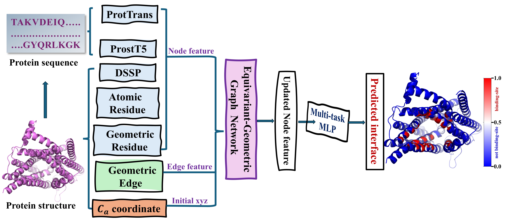

# MPBind: Multitask Protein Binding Site Prediction by Protein Language Models and Equivariant Graph Neural Networks

MPBind (Multitask Protein Binding Site Prediction by Protein Language Models and Equivariant Graph Neural Networks) is a parameter-free equivariant graph neural network designed to predict protein interaction interfaces from protein structures. It is available as a free online tool with no registration required.

## Installation
Download the source code and examples by cloning the repository.
```
git clone https://github.com/jianlin-cheng/MPBind.git
cd MPBind
```

The primary requirements for MPBind are [GEMMI](https://gemmi.readthedocs.io/en/latest/) to parse PDB files and [PyTorch](https://pytorch.org/) for the deep learning framework. During training, [h5py](https://www.h5py.org/) is used to store the processed data in an optimized format. The predicted interfaces can be visualized using [PyMOL](https://pymol.org/2/) or [ChimeraX](https://www.cgl.ucsf.edu/chimerax/). All the specific dependencies are listed in [MPBind.yml](MPBind.yml). The specific dependencies can be easily installed using [Anaconda](https://www.anaconda.com/). Create and activate the environement with:

```bash
conda env create -f MPBind.yml
conda activate MPBind
```
**1.** Download the pre-trained ProtT5-XL-UniRef50 model in [here](https://zenodo.org/record/4644188) (~ 5.3 GB) for ProtTrans model. The ProstT5 model will be automatically downloaded at the first time you run MPBind.  

**2.** Set the `ProtTrans_path` variable in ([experiment/inference.py](experiment/inference.py)) or ([experiment/train.py](experiment/train.py) to specify the location of the pretrained ProtTrans model in Step 1.

**3.** Set the `script_path` variable in ([experiment/inference.py](experiment/inference.py)) or ([experiment/train.py](experiment/train.py)) to the specific the directory containing the DSSP tool and Min-Max feature. By default, they should be in the same folder [src/feature_extraction](src/feature_extraction/).

**4.(optional)** Set the `file_path` variable in ([experiment/train.py](experiment/train.py)) to specify the pre-processed PDB file in HD5F format, if you want to train it by yourself.

**5.** Add permission to execute for DSSP by `chmod +x $script_path/mkdssp`  

## Available Dataset information used in our work

- All bioassemblies used are downloaded ([datasets/download_data.sh](datasets/download_data.sh)) from [RCSB PDB](https://www.rcsb.org/). The subunits are split into training, testing and validation dataset according to 30% sequence similarity clusters, The subunit information is in the `datasets` folder, with filenames starting with `subunits_` followed by `train`, `validation`, and `test` keywords, respectively. 

- The constructed dataset subunit information with the threshold by the released data is also provided in the [datasets/construct](datasets/construct/) folder.

- All the AlphaFold-predicted structures used can be downloaded freely from the [AlphaFold Protein Structure Database](https://alphafold.ebi.ac.uk/). Only the corresponding [UniProt](https://www.uniprot.org/) data is downloaded ([experiment/download_uniprot.py](experiment/download_uniprot.py)). 

- Finaly, we preprocess the structure, detect the interfaces within complexes and store the features and labels into an optimized HDF5 format ([experiment/build_dataset.py](experiment/build_dataset.py)).


## Other available pre-trained models

We provide 4 variants of the trained ProLEMB models:
- The `experiment` folder contains the scripts to train and inference the model.
- The `weight` folder contains different verison of the trained ProLEMB models, we recomand use the best version 2 to do inference.

## Inference by MPBind

The `MPBind` model can be applied to PDB files using the inference.py in the experiment folder. Specify the path to the folder containing the PDB files using the `input` variable. The predictions can be run on CPU or GPU. YOU can have a try with the provided example in `example` folder. All the generated intermediate information including prediction results will under the super folder `input` variable you provided.

```bash
# First step check the envirment whetther it is active, if not active the envirment 
conda activate MPBind

# Second step move to the experiment folder
cd experiment

# Third step do the inference
python inference.py --input [pdb_folder] --output [prediction_folder] --version [model_version]
```


## Training MPBind by Yourself
### If you want to retrain your own dataset, YOU can run `MPBind` by the following command:

```bash
# First step check the envirment whetther it is active, if not active the envirment 
conda activate MPBind

# Second step move to the experiment folder
cd experiment

# Third step do the inference
python train.py --epochs [Number_epoch] --folder [intermediate_folder] --version [model_version]
```

## Optional Parameter Explation:
### The optional parameters can by provided in the `python` command line:

```bash
# For inference:
--input          # Name the folder Where the PDB files are located during inference.   
--output         # Name the folder Where the predictions should  be stored, the predicted values will be saved in the B-factor field of the output PDB files.
--version        # Specify the model version for inference.
--binding_type   # Specify the binding types to infer as a list of integer values, 0: protein, 1:DNA/RNA, 2:ion, 3:ligand, 4:lipid.

# For training: 
--version        # Assign a name to the model version when training.
--nofeature      # An option to disable feature extraction during training, should be enabled for the first training run.
--track          # An option to enable Weights & Biases (wandb) tracking during training.
--folder         # The intermediate folder name to store all necessary information during training.
--epochs         # Set the number of epochs you want to train the model.
```

## Developer

```
Yanli Wang
Deparment of Computer Science
University of Missouri
Columbia, MO 65211, USA
Email: yw7bh@missouri.edu
```
## Contact

```
Jianlin (Jack) Cheng, PhD, AAAS Fellow
Curators' Distinguished Professor
William and Nancy Thompson Distinguished Professor
Department of Electrical Engineering and Computer Science
University of Missouri
Columbia, MO 65211, USA
Email: chengji@missouri.edu
```

## License
This project is covered under the MIT License

## Reference

MPBind: Multitask Protein Binding Site Prediction by Protein Language Models and Equivariant Graph Neural Networks.


